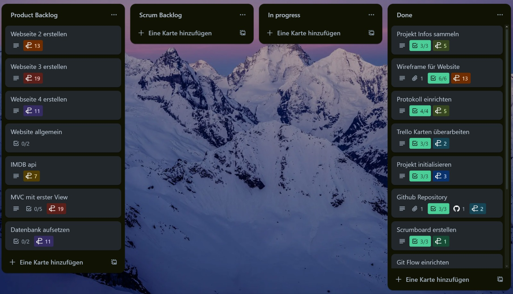
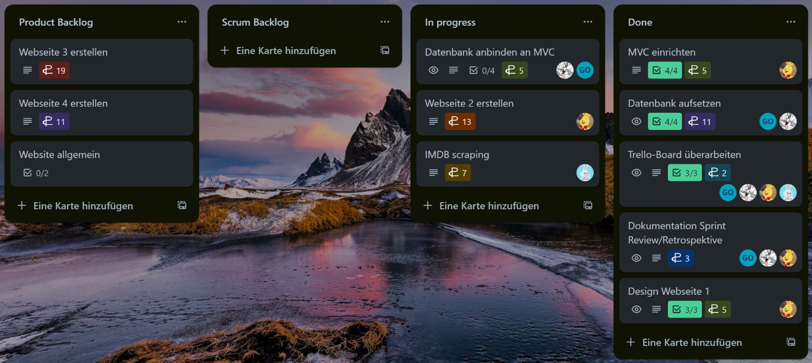
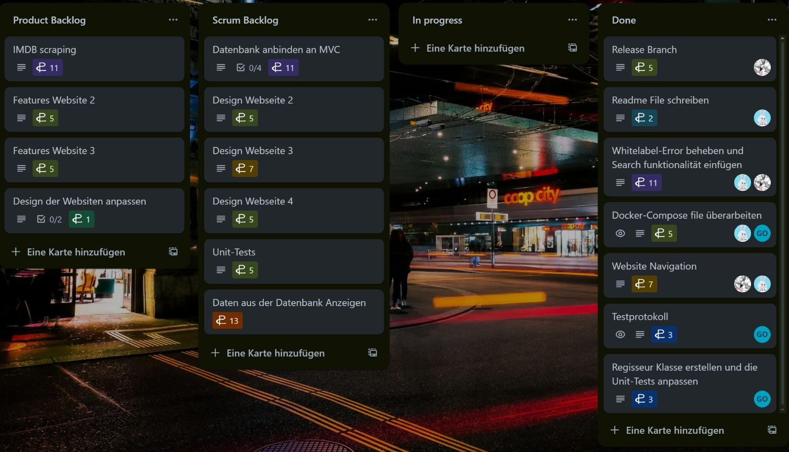

# FilmClub

In diesem Repository befindet sich das Projekt Film Club, welches dem M426 dient. In diesem Modul lernt man Agile Projektentwicklung und um das zu erlernen haben wir uns als Gruppe zusammengetan und arbeiten an diesem Projekt.

 <br>
 <br>
 <br>

## Voraussetzungen

Stelle sicher, dass du die Voraussetzungen erfüllst

* Du hast die README.md Dokumentation gelesen
* Du hast eine Java Entwickler Umgebung
* Du hast eine Maven Version
* Du hast einen funktionierenden Browser

## Film Club installieren

Um FilmClub zu installieren musst du folgendes machen:

```
git clone https://github.com/TihanMo/FilmClub
```

```
cd path/to/file/FilmClub
```

```
mvn clean package
```


## Tests

Die Tests sind unter diesem Pfad hinterlegt: `src/test/java/ch/bbw/group4/FilmClub`


## Mitwirkende

Gian Oechselin [https://github.com/AimceptionGian](https://github.com/AimceptionGian) 🧠  
Sven Lübcke [https://github.com/klionCH](https://github.com/klionCH) 😺  
Laurin Hubschmied [https://github.com/bambuk-Java](https://github.com/bambuk-Java) 😎  

## Quellen

* README.md wurde mit Hilfe diesem Templates erstellt [https://github.com/scottydocs/README-template.md](https://github.com/scottydocs/)
